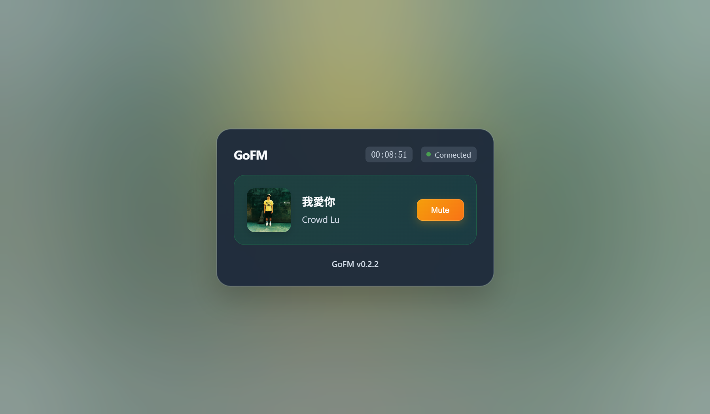

GoFM
=====
GoFM is a cross-platform real-time audio streaming server written in Go. It allows you to stream MP3 audio files from a specified directory over HTTP and synchronize playback across multiple clients.

[](https://golang.org/dl/)
[](https://goreportcard.com/report/github.com/pxgo/go-fm)
[](https://github.com/pxgo/go-fm/releases)
[](https://github.com/pxgo/go-fm/network/members)
[](https://github.com/pxgo/go-fm/blob/main/LICENSE)



## Usage

To use GoFM, download the latest release from the [Releases page](https://github.com/pxgo/go-fm/releases) and run the server with the following command:

 
```bash
./GoFM -d /path/to/your/music/directory
```

By default, GoFM listens on port 8090. You can customize the server's behavior using the following command-line options:

```text
-p int
    Specifies the server port number (default 8090).
-host string
    Specifies the server host address (default "0.0.0.0").
-r
    Enables random playback mode.
-debug
    Enables debug mode for the server.
-d string
    Specifies the directory to play audio files from (default "/path/to/your/music/directory").
-h
    Shows help information.
-n string
    Specifies the name of the FM (default "GoFM").
```

For example, to change the server's port number to 8080, use the -p option followed by the desired port number, like this:
 
```bash
./GoFM -d /path/to/your/music/directory -p 8080
```

You can find more information about GoFM on [STACKSTORE](https://stackstore.net/GoFM).

## Docker

You can run GoFM using Docker. A `Dockerfile` is provided for multi-stage build (Go 1.20 -> Alpine runtime).

### Build Image

 
```bash
docker build -t go-fm:latest .
```

Optional: pass a custom version (overrides `conf/version.txt`):

 
```bash
docker build --build-arg VERSION=v1.0.0 -t go-fm:v1.0.0 .
```

### Run Container

Assuming your host music directory is `~/music` (Linux/macOS) or `D:\\music` (Windows PowerShell example below):

PowerShell:
 
```powershell
docker run -d --name gofm `
    -p 8090:8090 `
    -v D:\music:/music:ro `
    go-fm:latest
```

Linux/macOS:
 
```bash
docker run -d --name gofm \
    -p 8090:8090 \
    -v ~/music:/music:ro \
    go-fm:latest
```

Custom options (e.g. random mode + custom name + different port):
 
```bash
docker run -d --name gofm \
    -p 8080:8080 \
    -v ~/music:/music:ro \
    go-fm:latest -d /music -p 8080 -r -n "MyFM"
```

### GitHub Container Registry (GHCR) Publish

1. Create a Personal Access Token (classic) or a fine‑grained PAT with `read:packages`, `write:packages` (and `delete:packages` if you need) scopes.
2. Login to GHCR:
   
            ```bash
        echo <YOUR_GHCR_PAT> | docker login ghcr.io -u <YOUR_GITHUB_USERNAME> --password-stdin
        ```
3. Build image with a version tag (example uses repository `pxgo/go-fm`):
   
            ```bash
        docker build -t ghcr.io/pxgo/go-fm:latest -t ghcr.io/pxgo/go-fm:$(cat conf/version.txt | tr -d '\r') .
        ```
4. Push tags:
   
            ```bash
        docker push ghcr.io/pxgo/go-fm:latest
        docker push ghcr.io/pxgo/go-fm:$(cat conf/version.txt | tr -d '\r')
        ```
5. (Optional) Add a README for the package: In GitHub UI go to `Packages` -> `go-fm` -> `Edit`.

#### GitHub Actions Automation

Create `.github/workflows/docker.yml` (example) to auto-build on release tags:

```yaml
name: Build & Publish Docker
on:
    push:
        tags:
            - 'v*'

permissions:
    contents: read
    packages: write

jobs:
    docker:
        runs-on: ubuntu-latest
        steps:
            - name: Checkout
                uses: actions/checkout@v4

            - name: Set up QEMU
                uses: docker/setup-qemu-action@v3

            - name: Set up Buildx
                uses: docker/setup-buildx-action@v3

            - name: Login to GHCR
                uses: docker/login-action@v3
                with:
                    registry: ghcr.io
                    username: ${{ github.actor }}
                    password: ${{ secrets.GITHUB_TOKEN }}

            - name: Extract version
                id: vars
                run: |
                    VERSION=$(cat conf/version.txt | tr -d '\r')
                    echo "version=$VERSION" >> $GITHUB_OUTPUT

            - name: Build & Push (multi-arch)
                uses: docker/build-push-action@v6
                with:
                    context: .
                    push: true
                    platforms: linux/amd64,linux/arm64
                    tags: |
                        ghcr.io/pxgo/go-fm:latest
                        ghcr.io/pxgo/go-fm:${{ steps.vars.outputs.version }}
                    build-args: |
                        VERSION=${{ steps.vars.outputs.version }}
```

After pushing a tag like `v0.2.4`, the workflow will publish both `latest` and the versioned tag to GHCR. Consumers pull with:
 
```bash
docker pull ghcr.io/pxgo/go-fm:latest
```

Or a specific version:
 
```bash
docker pull ghcr.io/pxgo/go-fm:v0.2.4
```

## License

GoFM is released under the [MIT License](https://github.com/pxgo/go-fm/blob/main/LICENSE). Feel free to use, modify, and distribute the software. Contributions are welcome!
